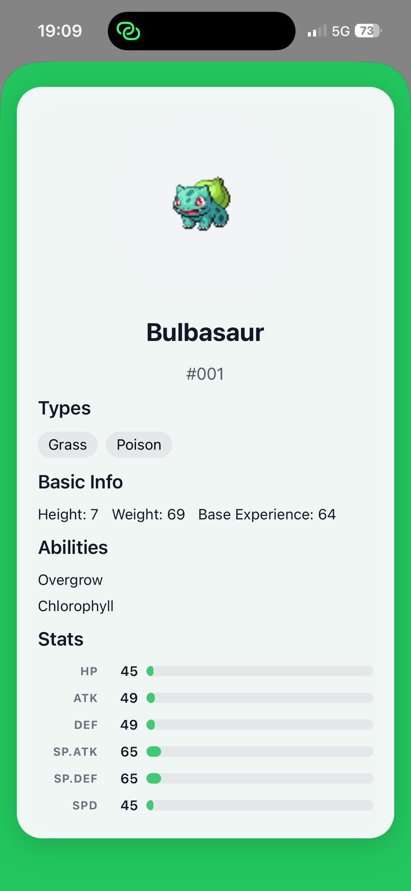
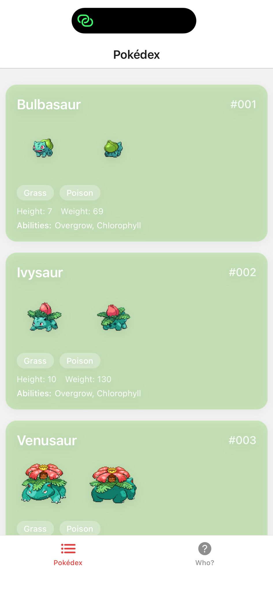
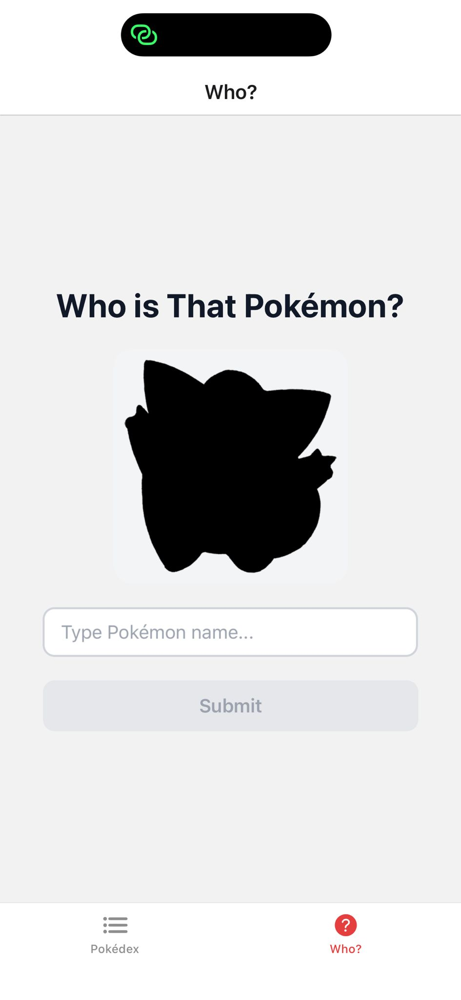
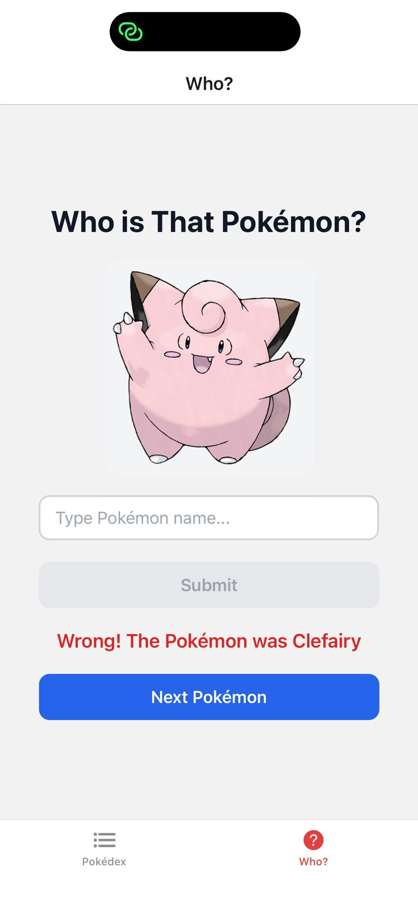
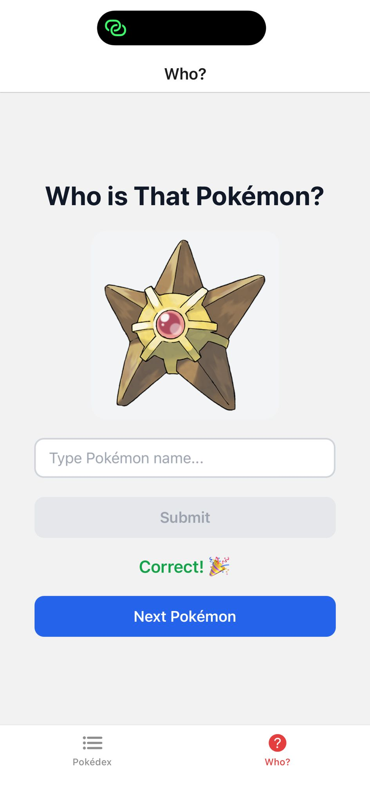

# Pokédex App

> ⚠️ **Work in Progress** — This project is currently under active development and is built for **learning purposes**.

A mobile Pokédex app built with React Native and Expo, featuring a Pokémon browser with details and a classic "Who's That Pokémon?" guessing game.

---

## 📱 Screenshots

### Pokédex List



### Pokémon Details



### Who's That Pokémon? — Hidden



### Who's That Pokémon? — Wrong Answer



### Who's That Pokémon? — Correct Answer



---

## ✨ Features

- 📋 **Pokédex List** — Infinite scroll list of all Pokémon, loading 20 at a time
- 🔍 **Pokémon Details** — Type-colored bottom sheet with stats, abilities, height, weight and animated stat bars
- 🎮 **Who's That Pokémon?** — Guessing game with Gen 1 Pokémon (1–151), black silhouette revealed on answer
- 🌐 **Cross-platform** — Runs on iOS, Android and Web

---

## 🛠️ Tech Stack

| Technology                                                                               | Version  | Purpose                                |
| ---------------------------------------------------------------------------------------- | -------- | -------------------------------------- |
| [React Native](https://reactnative.dev)                                                  | 0.81.5   | Mobile UI framework                    |
| [React](https://react.dev)                                                               | 19.1.0   | UI library (with concurrent rendering) |
| [Expo](https://expo.dev)                                                                 | ~54.0.33 | Development platform & SDK             |
| [Expo Router](https://expo.github.io/router)                                             | ~6.0.23  | File-based navigation                  |
| [TypeScript](https://www.typescriptlang.org)                                             | ~5.9.2   | Type safety                            |
| [React Navigation](https://reactnavigation.org)                                          | ^7       | Stack + Bottom Tabs navigator          |
| [React Native Reanimated](https://docs.swmansion.com/react-native-reanimated/)           | ~4.1.1   | Advanced animations                    |
| [React Native Gesture Handler](https://docs.swmansion.com/react-native-gesture-handler/) | ~2.28.0  | Gesture support                        |
| [React Native SVG](https://github.com/software-mansion/react-native-svg)                 | ^15.15.3 | SVG rendering (Pokeball)               |
| [PokéAPI](https://pokeapi.co)                                                            | —        | Free public Pokémon REST API           |

---

## 🏗️ Project Structure

```
pokedex/
├── app/
│   ├── _layout.tsx                   # Root Stack navigator
│   ├── details.tsx                   # Pokémon detail screen (modal bottom sheet)
│   ├── (tabs)/
│   │   ├── _layout.tsx               # Bottom tab navigator
│   │   ├── index.tsx                 # Pokédex list screen
│   │   └── who-is-that-pokemon.tsx   # Guessing game screen
│   └── components/
│       ├── PokemonCard.tsx           # List card with type colors
│       ├── StatsChart.tsx            # Animated stat bars
│       ├── LoadingPokeball.tsx       # Spinning Pokeball loader
│       └── PokeballSvg.tsx           # SVG Pokeball component
├── hooks/
│   ├── usePokemon.ts                 # Paginated list fetching
│   └── usePokemonDetails.ts          # Single Pokémon detail fetching
└── package.json
```

---

## 🚀 Getting Started

### Prerequisites

- [Node.js](https://nodejs.org) 18+
- [Expo Go](https://expo.dev/go) app on your phone, or an iOS/Android simulator

### Installation

```bash
# Clone the repo
git clone <your-repo-url>
cd pokedex

# Install dependencies
npm install

# Start the development server
npx expo start
```

Then scan the QR code with Expo Go (Android) or the Camera app (iOS).

---

## 📐 Architecture Highlights

- **File-based routing** via Expo Router — screens are defined by file structure under `app/`
- **Infinite scroll** — `usePokemon` hook batch-fetches 20 Pokémon per page with `Promise.all`
- **Modal bottom sheet** — details screen uses native iOS sheet with `sheetAllowedDetents` (30% / 60%)
- **Animated stats** — `StatsChart` uses `React Native Animated API` with staggered entry (80ms per stat)
- **Type theming** — all 18 Pokémon types are mapped to hex colors, applied to cards and detail backgrounds
- **Uncontrolled input pattern** — the guessing game uses `useRef` for the text value to avoid re-renders on every keystroke (React 19 compatibility)

---

## 🌱 Learning Goals

This project was built to learn and practice:

- React Native fundamentals and layout system
- Expo Router for file-based mobile navigation
- Custom hooks for data fetching and state management
- React Native Animated API for smooth UI animations
- Consuming a public REST API (PokéAPI)
- TypeScript in a React Native context
- Cross-platform considerations (iOS vs Android behavior)

---

## 📡 Data Source

All Pokémon data is fetched from [PokéAPI](https://pokeapi.co) — a free, open Pokémon REST API. No API key required.

# license

MIT License

